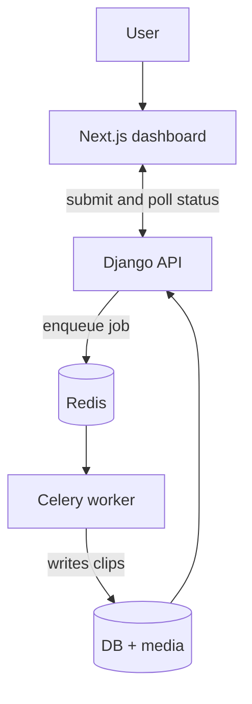
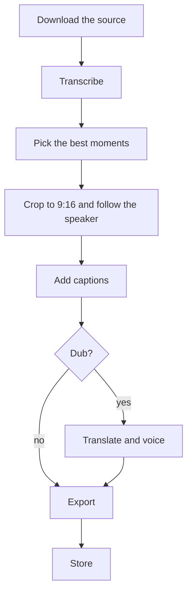

# Moment

Moment turns a long video into short vertical clips. Give it a YouTube link or a
file, and it finds the moments worth clipping, crops each one to 9:16 so the frame follows
whoever is talking, and burns in captions. It can also dub the clips into another language.

It runs local-first. With just an Anthropic API key everything works on your machine.
Cloudinary and Supabase are optional, for cloud storage and auth if you want them.

## How it works



A request from the dashboard hits the Django API, which queues a job and returns right
away. A Celery worker does the actual processing, so the API never blocks on a long video.
If you would rather not run Redis, leave `USE_CELERY` off and the job runs in a background
thread instead.

Inside the worker each video goes through the same pipeline:



1. Transcribe the audio with faster-whisper.
2. Ask Claude to read the transcript and return the best 30 to 60 second moments, ranked.
3. Crop each moment to 9:16 and track the active speaker.
4. Diarize the clip and burn in word-level captions, colored per speaker.
5. Optionally translate the transcript with Claude and voice it with Deepgram, then export
   with ffmpeg.

### Following the speaker

The reframe is the part a language model cannot do, since it never sees the video. For each
clip Moment runs a YuNet face detector and Silero voice-activity detection, measures how
much each face's mouth is moving, and decides who is speaking. The 9:16 crop then pans to
keep that person in frame. On a single-speaker clip it just tracks the one face; in an
interview it follows the back-and-forth. If it cannot find a face it falls back to a
center crop.

### Picking moments

Choosing which moments to clip is a language problem, so Claude does it from the transcript.
Early on I built an ML model that scored clips from audio and text signals (speech emotion,
energy, laughter) to try to do this instead, and checked it against YouTube's "most
replayed" data. It did not beat Claude, so it stayed out of the pipeline. The experiment,
including the dataset builder and the eval harness, is in `server/eval` if you want to read
the numbers.

## Running it

You need an `ANTHROPIC_API_KEY`. `DEEPGRAM_API_KEY` is only needed for the dubbing flow.
Speaker-colored captions use a gated `pyannote` model; without it, captions still render in
a single highlight color.

### With Docker

```bash
git clone https://github.com/Manas-33/Moment.git
cd Moment
# create server/.env with your keys (see the env block below)
docker compose up --build
```

That brings up the API, a Celery worker, and Redis on `http://localhost:8000`. Run the
client separately.

### Without Docker

Server:

```bash
cd server
python -m venv venv
source venv/bin/activate       # Windows: venv\Scripts\activate
pip install -r requirements.txt
python manage.py migrate
python manage.py runserver
```

Client:

```bash
cd client
npm install
npm run dev                    # http://localhost:3000
```

A minimal `server/.env`:

```env
ANTHROPIC_API_KEY=your_key
DEEPGRAM_API_KEY=your_key      # dubbing only

# optional, leave blank to stay local
CLOUDINARY_CLOUD_NAME=
CLOUDINARY_API_KEY=
CLOUDINARY_API_SECRET=
SUPABASE_URL=
SUPABASE_KEY=

# leave USE_CELERY off to run jobs in a thread instead of on a worker
USE_CELERY=
CELERY_BROKER_URL=redis://localhost:6379/0

DEBUG=True
SECRET_KEY=any-string
PUBLIC_BASE_URL=http://localhost:8000
```

To run a worker locally you need Redis running, then:

```bash
cd server
celery -A shorts_generator worker --loglevel=info
```

## Stack

Frontend is Next.js and TypeScript with Tailwind and shadcn/ui. Backend is Django REST
Framework with Celery and Redis for the async jobs.

The media and ML pieces:

- Claude (Anthropic) for highlight detection and translation
- faster-whisper for transcription
- YuNet face detection, Silero VAD, and mouth-region motion for the speaker-following crop
- pyannote for diarization, so captions can be colored by speaker
- moviepy 2 and Pillow for caption rendering, ffmpeg for cutting and muxing
- Deepgram for dubbing voices

Storage is the local filesystem by default, or Cloudinary. The database is SQLite by
default, or Supabase. There is a GitHub Actions workflow that runs the server tests and the
client build, and OpenAPI docs are served at `/api/docs/`.

## Layout

```
client/                Next.js dashboard
server/
  shorts_api/          REST API, models, and the Celery tasks
  shorts_generator/    Django project and Celery app
  Components/          the pipeline: download, transcribe, highlight, crop, caption, dub
  eval/                the engagement-scoring experiment (not wired into the pipeline)
docker-compose.yml     redis, web, and worker
```

## Tests

```bash
cd server && python -m pytest
```

## License

MIT. See LICENSE.
